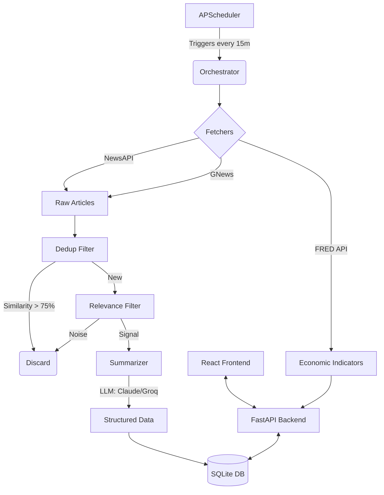

# EconWatch Project Guide

## Architecture

## Design Decisions & Rationale

1. **Polling vs. Webhooks (MVP)**:
   For this MVP, a polling architecture (APScheduler triggering every 15 minutes) was chosen. While webhooks/streaming are more efficient for production news, polling is simpler to set up locally without needing public endpoints or complicated infrastructure, which fits an MVP well.

2. **Soft-Delete Strategy**:
   When users remove a topic or source, the entity is marked `is_active = false` rather than hard-deleted. This prevents historical articles from being orphaned and allows users to restore topics easily.

3. **LLM Fallback**:
   To ensure the pipeline never fully stalls during LLM API rate limits or outages, a keyword-based fallback was implemented for the relevance filter, and a basic truncation fallback was added for summarization.

4. **FRED + News APIs Combined**:
   The dashboard combines qualitative AI-filtered news with hard quantitative data (FRED). This ensures the interface doesn't just read like a typical newsfeed, but acts as a true economic monitor.

## Known Limitations

- **Rate Limits**: Free API keys (especially GNews and NewsAPI) have strict rate limits. The application handles errors gracefully but might stop fetching if limits are exceeded.
- **Single User**: There is no authentication or multi-tenant support yet. All topics and sources are globally applied.
- **Language**: The fetchers are currently hardcoded to search for English (`en`) articles.
